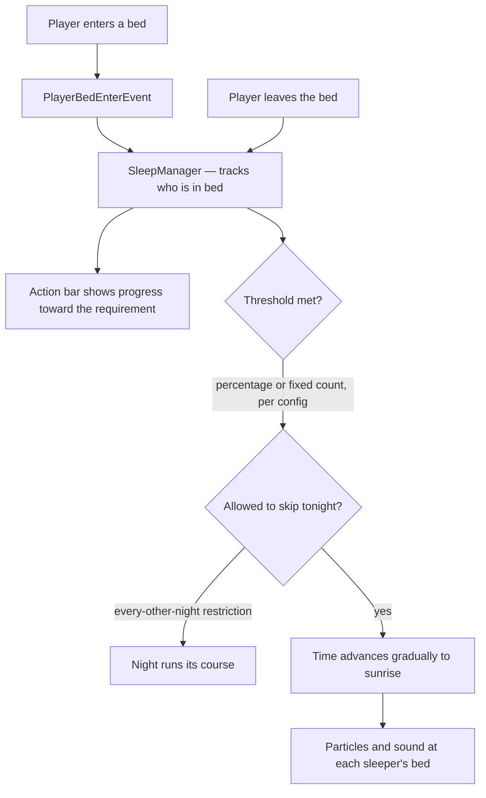

<h1 align="center">OnePlayerSleep+</h1>

<p align="center">
  <b>Skip the night when enough players sleep, instead of when every last one does.</b>
</p>
<p align="center">
  Set the bar as a fixed number of sleepers or a share of the players online. Time then rolls<br />
  to morning rather than snapping, with an action bar showing how close the server is.
</p>

<p align="center">
  
  
  
  
  
</p>

<br />

## Why OnePlayerSleep+

Vanilla ties the night to a percentage nobody can see, so a server spends it guessing: are we close, is somebody asleep at the keyboard in a cave, has this already failed. The usual fix swings the other way and lets one player end the night for everybody, which is its own kind of annoying on a busy server. OnePlayerSleep+ puts the threshold where the owner wants it, shows the count while people are in bed so the room knows whether it is worth getting up for, and moves time forward gradually so the skip reads as dawn rather than a jump cut.

<table width="100%">
  <tr>
    <td width="50%" valign="top">
      <h3 align="center">A threshold you can see</h3>
      <p align="center">While anyone is in bed the action bar carries progress toward the requirement, so nobody has to guess whether one more sleeper would do it.</p>
    </td>
    <td width="50%" valign="top">
      <h3 align="center">Morning arrives, it does not cut</h3>
      <p align="center">Time advances smoothly to sunrise with particles and sound at each sleeper's bed, and an optional restriction holds skips to every other night.</p>
    </td>
  </tr>
</table>

<br />

## Stack

| Layer | Technology |
| :--- | :--- |
| Language | Java 21 bytecode |
| Server API | paper-api 1.21.5 (`api-version: 1.21`) |
| Build | Maven with `maven-shade-plugin` |
| Bundled | CoreAPI 1.1.0, UpdaterAPI 1.0.0, bStats 3.0.2 |

## Requirements

- Paper or Spigot, Minecraft 1.21 through 26.2
- Java 21 or newer

## Getting started

Drop the jar into your server's `plugins` folder and restart. The plugin writes `config.yml` and `messages.yml` into `plugins/OnePlayerSleepPlus/` on first start.

Published on Spigot: <https://www.spigotmc.org/resources/124265/>

## Configuration

| Key | Does |
| :--- | :--- |
| `sleep_requirement.mode` | `fixed` or `percentage`. |
| `sleep_requirement.fixed_players` | Sleepers needed in `fixed` mode. |
| `sleep_requirement.percentage` | Share of online players needed in `percentage` mode. |
| `announce.enabled` | Broadcast a message when the night is skipped. |
| `action_bar.enabled` | Show sleep progress in the action bar. |
| `time_skip_effects` | Particle and sound shown during the skip. |
| `night_skip_restriction.every_other_night` | Allow skipping only every other night. |
| `auto_updater.enabled` | Check for new versions on startup and install them at shutdown. |

All player-facing text lives in `messages.yml` and supports `&` color codes. Removing a message disables it.

## Permissions

| Node | Default | Grants |
| :--- | :--- | :--- |
| `oneplayersleepplus.update.notify` | op | Receive update notifications. |

## Architecture



## How it works

- **The threshold is visible while it matters.** An action bar task runs only while somebody is in bed, carrying the count toward the requirement, so the room can tell whether one more sleeper would finish it.
- **Two ways to set the bar.** `sleepMode` picks between a percentage of players online and a fixed number of sleepers, so a two-person server and a fifty-person server can both land somewhere sensible.
- **Morning arrives rather than cuts.** Time is advanced in steps to sunrise instead of set in one write, which is what makes the skip read as dawn breaking; particles and sound fire at each sleeper's bed as it runs.
- **Skips can be rationed.** The optional every-other-night restriction holds a successful skip and refuses the next one, so a server that wants some nights to actually happen keeps them.
- **Sleepers are tracked by UUID in a concurrent map**, so a player who disconnects in bed stops counting toward the threshold the moment the bed-leave fires.

## Project structure

```
oneplayersleepplus/
└── src/main/java/com/trenton/oneplayersleepplus/
    ├── OnePlayerSleepPlus.java        Plugin entry and CoreAPI bootstrap
    ├── managers/SleepManager.java     Threshold maths, gradual time skip, effects
    └── listeners/SleepListener.java   Bed enter and leave, action bar progress
```

## Building

The plugin depends on two libraries that install to your local Maven repository:

```bash
git clone https://github.com/bradley-t-t/coreapi && mvn -f coreapi install
git clone https://github.com/bradley-t-t/updaterapi && mvn -f updaterapi install
```

Then build the plugin jar:

```bash
mvn package
```

The shaded jar lands in `target/`.

## License

Copyright (c) 2026 Trenton Taylor. All rights reserved.

<br />

<p align="center">
  <sub>Enough people are asleep. That should be enough.</sub>
</p>
